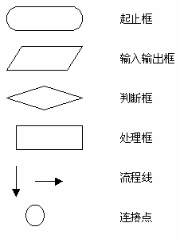

## 回顾：
    书写程序时应遵循的规则
    从书写清晰，便于阅读，理解，维护的角度出发，在书写程序时应遵循以下规则：
    1.一个说明或一个语句占一行。
    2.用{} 括起来的部分，通常表示了程序的某一层次结构。{}一般与该结构语句的第一
    个字母对齐，并单独占一行。
    3.低一层次的语句或说明可比高一层次的语句或说明缩进若干格后书写。以便看起来更
    加清晰，增加程序的可读性。
    在编程时应力求遵循这些规则，以养成良好的编程风格。

## C 与 C++的区别

    C++支持用流输入输出，而 C 只能用 scanf 和 printf——再见了，%d！

    C++非常支持面向对象编程，而 C 已经“out”了。
    《资料》中的“高精度算法”就只能用 C++完成，因为在 struct 内定义了成员函数。

    C++可以用更强大的 string 类处理字符串，而不必担心发生某些低级错误。

    C++有强大的 STL，而 C 没有（有一个小小的 qsort 和 bsearch 算是补偿了）。
    STL 是很多人从 C 转到 C++的重要原因。

    C 的头文件名仍然可以用在 C++中，不过可能会收到警报——应该去掉“.h”，前面再加一个“c”。
    如<stdio.h>应该改成<cstdio>。

    C 程序运行速度稍优于 C++。不过也没快多少。

    总之，C 能做的一切事情，C++也能做；C++能做的一切事情，C 不一定能做。

## Ｃ/C++ 的字符集

    字符是组成语言的最基本的元素。Ｃ语言字符集由字母，数字，空格，标点和特殊字符
    组成。在字符常量，字符串常量和注释中还可以使用汉字或其它可表示的图形符号。
    1.字母
    小写字母 a～z 共 26 个
    大写字母 A～Z 共 26 个
    2.数字
    0～9 共 10 个
    3.空白符
    空格符、制表符、换行符等统称为空白符。空白符只在字符常量和字符串常量中起作用。
    在其它地方出现时，只起间隔作用，编译程序对它们忽略不计。因此在程序中使用空白符与
    否，对程序的编译不发生影响，但在程序中适当的地方使用空白符将增加程序的清晰性和可
    读性。
    4.标点和特殊字符

## Ｃ/C++词汇
    在Ｃ/C++中使用的词汇分为六类：标识符，关键字，运算符，分隔符，常量，注释符等。

## C 语言简洁、紧凑，使用方便、灵活。ANSI C 一共只有 32 个关键字:
    auto break case char const continue default
    do double else enum extern float for
    goto if int long register return short
    signed static sizof struct switch typedef union
    unsigned void volatile while

## Ｃ源程序的结构特点

    1.一个Ｃ语言源程序可以由一个或多个源文件组成。
    2.每个源文件可由一个或多个函数组成。
    3.一个源程序不论由多少个文件组成，都有一个且只能有一个 main 函数，即主函数。
    4.源程序中可以有预处理命令(include 命令仅为其中的一种)，预处理命令通常应放在源
    文件或源程序的最前面。
    5.每一个说明，每一个语句都必须以分号结尾。但预处理命令，函数头和花括号“}”
    之后不能加分号。
    6.标识符，关键字之间必须至少加一个空格以示间隔。若已有明显的间隔符，也可不再
    加空格来间隔。

## 程序的灵魂—算法

    一个程序应包括：
        对数据的描述。在程序中要指定数据的类型和数据的组织形式，即数据结构（data structure）。
    对操作的描述。即操作步骤，也就是算法（algorithm）。
        数据结构+算法=程序
    一般认为：
        程序=算法+数据结构+程序设计方法+语言工具和环境
        这 4 个方面是一个程序涉及人员所应具备的知识。
    算法：
        做任何事情都有一定的步骤，为解决一个问题而采取的方法和步骤。
    举例：
        求n!。
        1*2*3*4*...*n
    怎样表示？
        流程图：流程图表示算法，直观形象，易于理解。    
        
